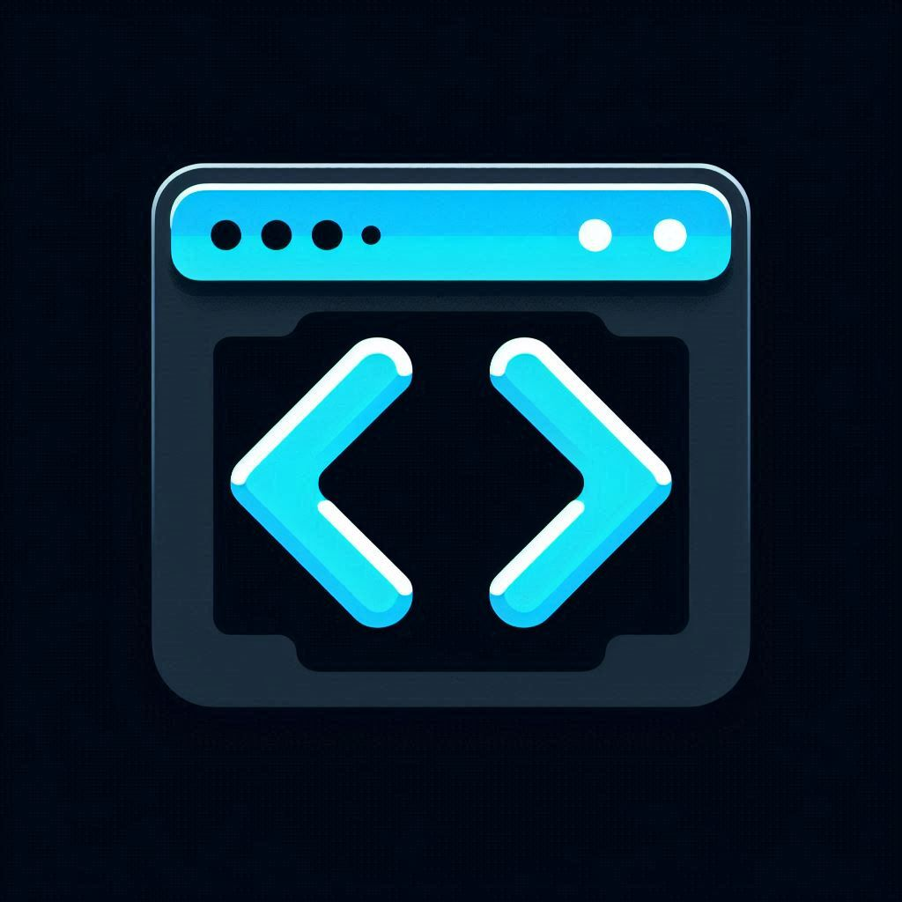
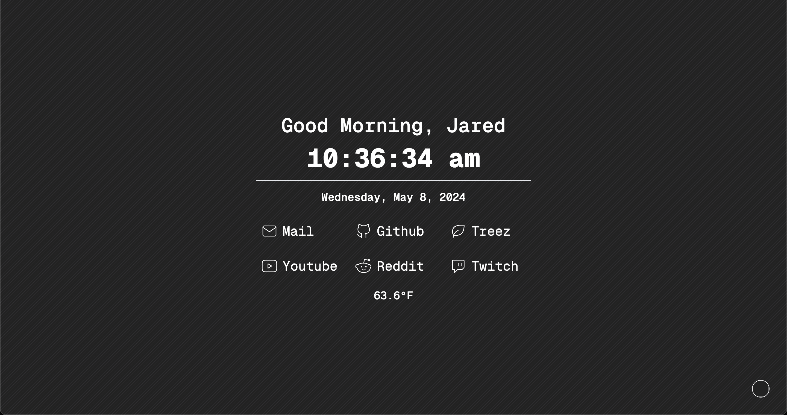

<div align="center">
<a href="https://github.com/othneildrew/Best-README-Template">
    
</a>
</div>

<h1 align="center">Jared's New Tab</h1>

<div align="center">This is a simple new tab page that I made for myself.</div>

## Features

- Color picker to change the background color

- Greeting header that changes based on the time of day

- Large clock that displays the time

- Small clock that displays the date

- Grid of common links

- Weather widget

## Screenshots



## Installation

1. Clone the repository

```bash
git clone git@github.com:jaredthecomputerguy/jareds-new-tab.git
```

2. Install dependencies

```bash
npm install
```

3. Run the development server

```bash
npm run dev
```

## Roadmap

- [x] Add a color picker so I can change the background color at any time

- [x] Add a header that says good morning, good afternoon, etc. to myself

- [x] Add a large clock that displays the time (HH:MM:SS)

- [x] Add a smaller clock that displays the date (Monday, January 1)

- [x] Add a two row, three column grid of common links

- [x] Add a weather widget

- [ ] TODO: Add a settings sidebar where I can change settings + widgets

## Tools

- [WXT](https://wxt.dev/)

- [React](https://react.dev)

- [Typescript](https://www.typescriptlang.org/)

- [Tailwind](https://tailwindcss.com)
